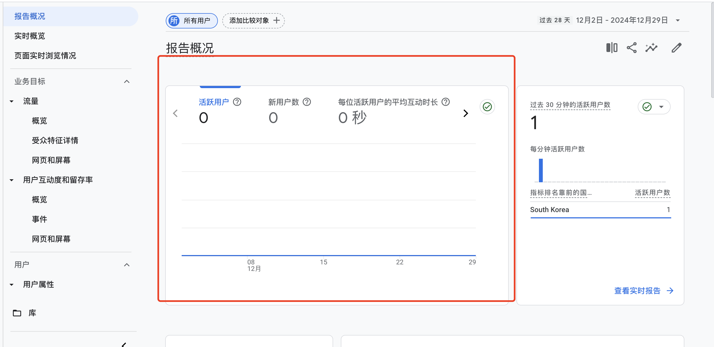
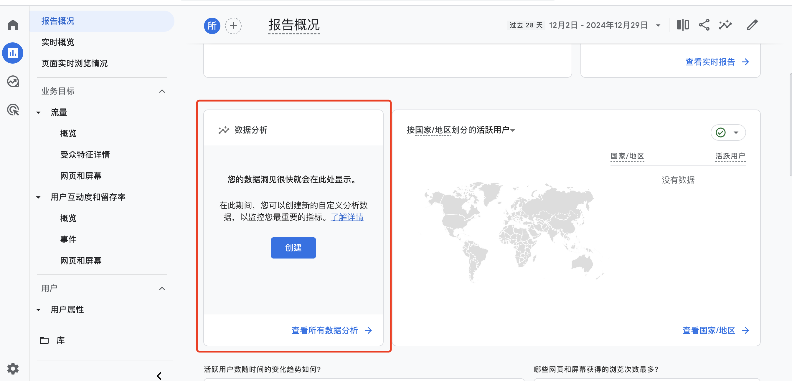
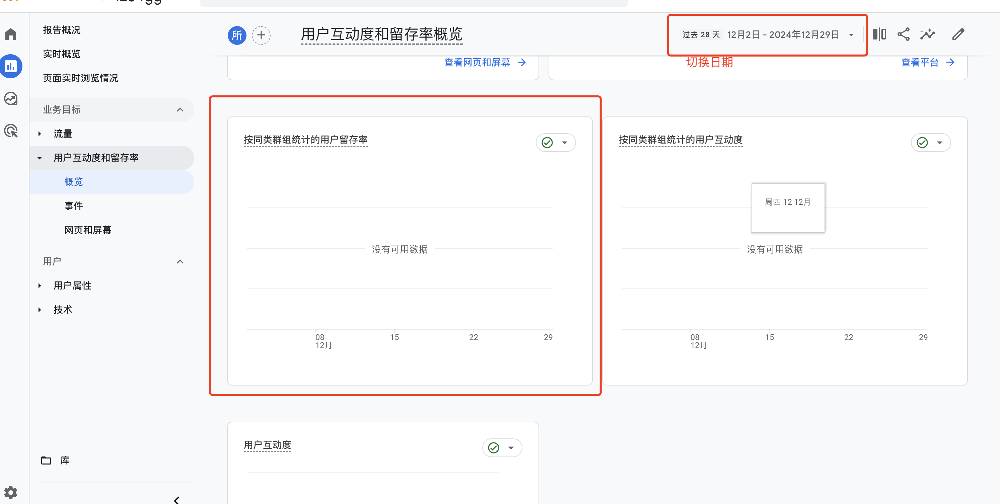
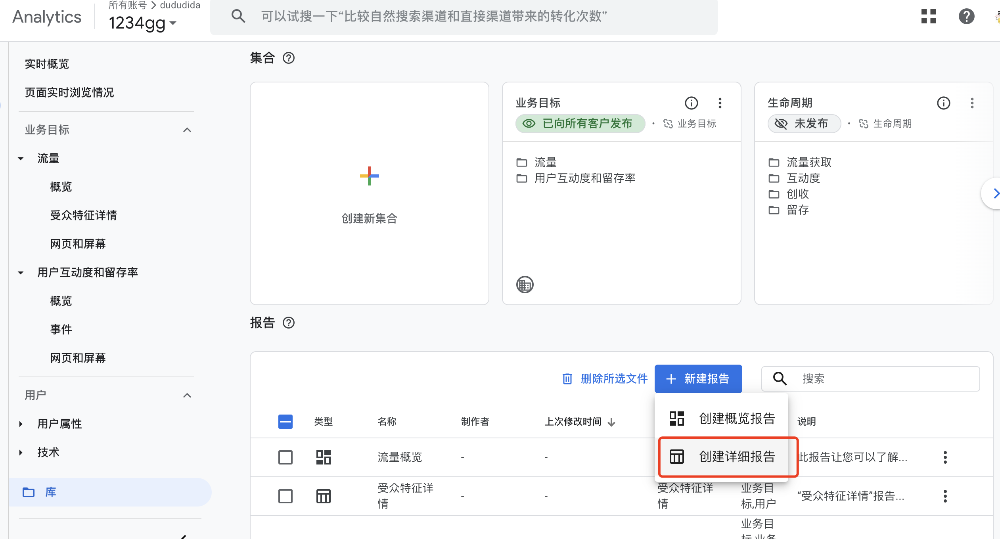
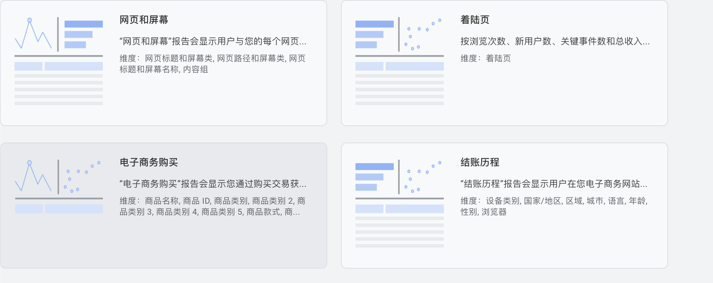
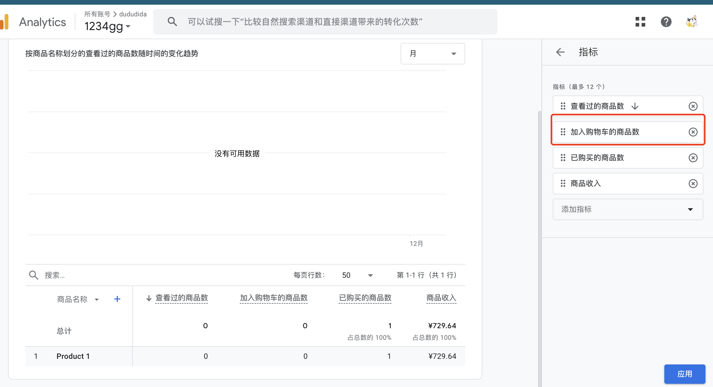

# GA4 配置文档

##### 版本: v0.1  

##### 最后修订时间: 2025.01.01 00:07

##### 修订人: ShowPenZ

## 1.大盘

1. #### 基本用户数量

   1. 指标

      以下两个指标会通过GA4自动追踪采集**无需额外配置**，维度为时间和国家地区

      

      **采集的内容为用户活跃事件 唯一用户标识 时间信息  地理位置信息**

      1. DAU (日活)

      2. DNU(新增用户)

         

      当前两个指标都可以直接在报告概况查看

      

      

      

      也可以通过自定义规则配置创建需要的过滤查询

      

2. #### 留存

   1. 指标

      以下两个指标会通过GA4自动追踪采集**无需额外配置**，维度为时间和国家地区

      

      **采集的内容为首次访问事件 后续访问事件 用户 ID 或设备 ID**

      1. 次日留存
      2. 7日留存

       当前两个指标都可以直接在报告>用户互动率和留存率里的概览里查看
      

3. #### GMV

   1. 指标为商品交易总额 当前下为用户付费视频或者图片的直接金额
      即 GMV = 商品数量 * 金额
      此数据采集需要前端进行 GA4的purchase事件的埋点上报

   ```javascript
   window.gtag('event', 'purchase', {
       transaction_id: 'ORDER12345', // 可以传入响应的购买id
       value: 3000,  // 购买价格
       currency: 'start', // 币种
       items: [{ id: '9998', value:3000}],// 商品的id和价格
   })
   // 记录用户消费爱好的习惯 以及消费金额区间等
   ```

   GA4 GMV指标创建的操作方式 

   1. 在报告栏目的库中新建报告点击创建详细报告

      2. 向下滑动选择电子商务购买

         

   3. 可以选择指标例如将购物车相关指标删除减少干扰
      
